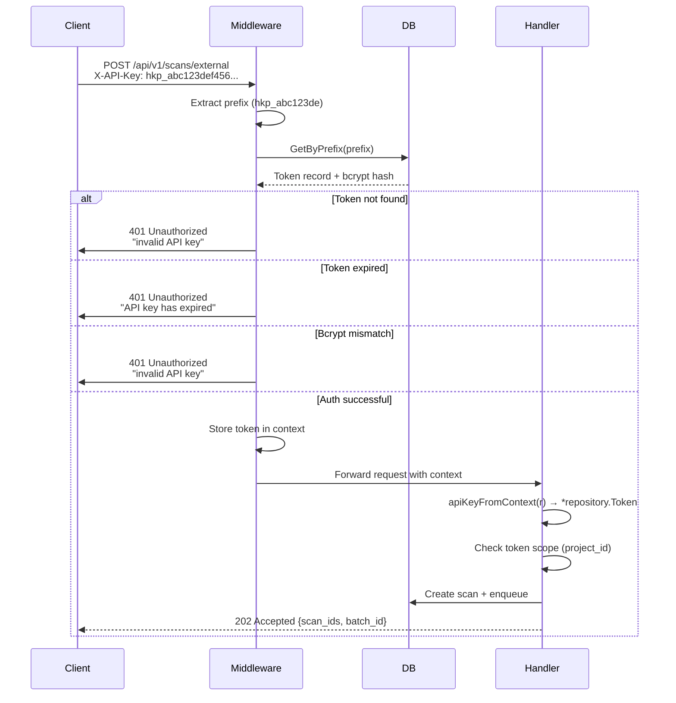
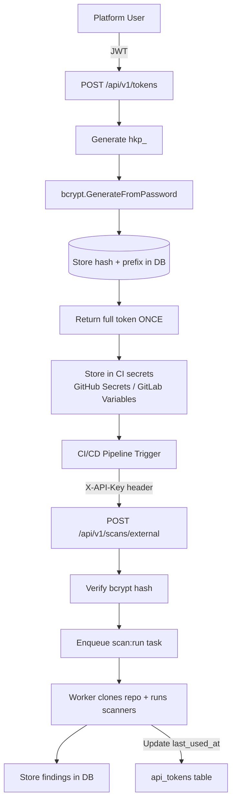

# CI/CD Integration Architecture

## Overview

HenKaiPan supports external CI/CD integration through a dedicated API surface that allows security scans to be triggered from third-party pipelines (GitHub Actions, GitLab CI, Jenkins, etc.). This document explains the architecture, authentication model, and data flow.

---

## 1. Architecture Overview

```mermaid
flowchart LR
    subgraph "External CI/CD Domain"
        CI[GitHub Actions / GitLab CI] --> Action[henkaipan-action<br/>Docker container]
        Action -->|X-API-Key| API
    end

    subgraph "Platform Domain"
        UI[Astro Frontend] -->|JWT| API
    end

    subgraph "API Layer (Go + chi)"
        API[API Router]
        
        subgraph "JWT Auth Routes"
            API --> Tokens[GET/POST /api/v1/tokens<br/>DELETE /api/v1/tokens/{id}]
            API --> Scans[GET/POST /api/scans]
            API --> Findings[GET/PATCH /api/findings]
        end
        
        subgraph "API Key Auth Routes"
            API --> ExtScans[POST /api/v1/scans/external<br/>GET /api/v1/scans/{id}/status]
        end
        
        Tokens --> JWTAuth{Middleware:<br/>JWTMiddleware}
        Scans --> JWTAuth
        Findings --> JWTAuth
        ExtScans --> APIKeyAuth{Middleware:<br/>APIKeyAuth}
    end

    subgraph "Data Layer"
        JWTAuth --> DB[(PostgreSQL)]
        APIKeyAuth --> DB
        API --> DB
    end

    subgraph "Async Layer"
        API -->|enqueue| Queue[(Redis + Asynq)]
        Queue -->|dequeue| Worker[Worker Process]
        Worker -->|clone + scan| Repo[Git Repository]
        Worker -->|insert findings| DB
        Worker -->|update status| DB
    end
```

### Key Design Principles

| Principle | Description |
|-----------|-------------|
| **Domain separation** | Platform (JWT) and CI/CD (API key) use completely separate auth middleware stacks |
| **No pass-through** | API key middleware returns `401` on failure — never silently passes to next handler |
| **Shared scan logic** | Both internal and external scan creation use the same `createScanRecords` helper |
| **Minimal CI scope** | CI tokens can only create scans and check status — no read/write access to other resources |

---

## 2. Authentication Model

### Two Separate Auth Domains

```
┌─────────────────────────────────────────────────────────┐
│  API Router                                             │
│                                                         │
│  /api/health, /api/auth/*           → no auth           │
│                                                         │
│  /api/v1/scans/*                    → API Key Auth      │
│    POST /external                   → CreateExternalScan│
│    GET  /{id}/status                → GetStatus         │
│                                                         │
│  /api/v1/tokens/*                   → JWT Auth          │
│    GET    /tokens                   → ListTokens        │
│    POST   /tokens                   → CreateToken       │
│    DELETE /tokens/{id}              → DeleteToken       │
│                                                         │
│  /api/scans, /api/findings, etc.    → JWT Auth          │
└─────────────────────────────────────────────────────────┘
```

### API Key Middleware Flow



### Token Lifecycle



---

## 3. API Endpoints

### 3.1 External Scan Triggers (API Key Auth)

#### `POST /api/v1/scans/external`

Creates scan records and enqueues them for the worker to process.

**Headers:**
```
X-API-Key: hkp_abc123def456789...
Content-Type: application/json
```

**Request Body:**
```json
{
  "project_id": "550e8400-e29b-41d4-a716-446655440000",
  "repo_url": "https://github.com/example/myapp.git",
  "scanners": ["semgrep", "trivy"],
  "branch": "main"
}
```

| Field | Type | Required | Description |
|-------|------|----------|-------------|
| `project_id` | string | Yes | Target project UUID |
| `repo_url` | string | No | Git clone URL. Falls back to project's configured repo |
| `scanners` | []string | No | Scanner names or packs. Defaults to `["all"]` |
| `branch` | string | No | Git branch to scan. Appended as `repo_url#branch` |

**Response (202 Accepted):**
```json
{
  "scan_ids": ["uuid-1", "uuid-2", "uuid-3"],
  "batch_id": "uuid-batch",
  "status": "accepted"
}
```

**Scope Check:**
If the token is project-scoped (`token.project_id != nil`), the API verifies that `token.project_id == request.project_id`. Otherwise returns `403 Forbidden`.

#### `GET /api/v1/scans/{id}/status`

Poll the status of a previously created scan.

**Response (200 OK):**
```json
{
  "scan": {
    "id": "uuid-1",
    "target": "https://github.com/example/myapp.git#main",
    "scanner": "semgrep",
    "status": "completed",
    "created_at": "2025-01-15T10:00:00Z"
  },
  "findings": [...]
}
```

### 3.2 Token Management (JWT Auth)

#### `POST /api/v1/tokens`

Create a new API token.

**Request Body:**
```json
{
  "name": "ci-pipeline-token",
  "project_id": "optional-uuid"
}
```

**Response (201 Created):**
```json
{
  "token": "hkp_abc123def456789...",
  "id": "token-uuid",
  "name": "ci-pipeline-token",
  "prefix": "hkp_abc123de"
}
```

⚠️ **The full token value is only shown once at creation time.** Store it securely immediately.

#### `GET /api/v1/tokens`

List all tokens owned by the current user.

**Response (200 OK):**
```json
{
  "tokens": [
    {
      "id": "uuid",
      "name": "ci-pipeline-token",
      "prefix": "hkp_abc123de",
      "project_id": null,
      "last_used_at": "2025-01-15T10:00:00Z",
      "expires_at": null,
      "created_at": "2025-01-01T00:00:00Z"
    }
  ]
}
```

#### `DELETE /api/v1/tokens/{id}`

Revoke a token. Only the token creator can revoke.

**Response (200 OK):**
```json
{
  "status": "revoked"
}
```

---

## 4. Shared Scan Creation Logic

Both internal (`POST /api/scans`) and external (`POST /api/v1/scans/external`) scan creation use the same core helper:

```
                    ┌─────────────────────────┐
                    │   resolveScanners()     │
                    │   Resolve packs → names │
                    └────────────┬────────────┘
                                 │
                    ┌────────────▼────────────┐
                    │  createScanRecords()    │
                    │  Insert + Enqueue loop  │
                    └────────────┬────────────┘
                                 │
          ┌──────────────────────┼──────────────────────┐
          │                      │                      │
    ┌─────▼─────┐        ┌──────▼──────┐        ┌──────▼──────┐
    │CreateScan │        │createAppScans│        │CreateExtScan│
    │(JWT)      │        │(JWT)         │        │(API Key)    │
    └───────────┘        └──────────────┘        └─────────────┘
```

```go
// shared helper — both internal and external callers use this
func (h *Handler) createScanRecords(
    ctx context.Context,
    target string,
    scannerNames []string,
    projectID *string,
    batchID string,  // "" = generate new
) (ids []string, outBatchID string, err error)
```

### Scanner Resolution

| Input | Resolves To |
|-------|-------------|
| `"semgrep"` | `["semgrep"]` |
| `"all"` | `["semgrep", "trivy", "gitleaks", "checkov", "nuclei", ...]` |
| `["semgrep", "trivy"]` | `["semgrep", "trivy"]` |

---

## 5. GitHub Action Configuration

The `henkaipan-action` is a Docker-based action that calls the HenKaiPan API.

### Example Workflow

```yaml
name: Security Scan
on:
  push:
    branches: [main]
  pull_request:
    branches: [main]

jobs:
  scan:
    runs-on: ubuntu-latest
    steps:
      - uses: actions/checkout@v4

      - name: Run HenKaiPan Security Scan
        uses: dyallab/henkaipan-action@v1
        with:
          api-url: https://app.henkaipan.com
          api-key: ${{ secrets.HENKAIPAN_API_KEY }}
          project-id: your-project-uuid
          scanners: all
          fail-on-severity: critical
```

### Action Inputs

| Input | Required | Default | Description |
|-------|----------|---------|-------------|
| `api-url` | Yes | - | HenKaiPan instance URL |
| `api-key` | Yes | - | API key from `/api/v1/tokens` |
| `project-id` | Yes | - | Target project UUID |
| `scanners` | No | `all` | Scanner names or packs |
| `fail-on-severity` | No | - | Exit code 1 if findings >= severity |

---

## 6. Connectivity Scenarios

| Scenario | Description | Solution |
|----------|-------------|----------|
| **Public SaaS** | Managed instance (`app.henkaipan.com`) | Action points to public URL ✅ |
| **Self-hosted (public URL)** | User exposes HenKaiPan at `henkaipan.company.com` | Action points to configured URL ✅ |
| **Self-hosted (VPN/private)** | HenKaiPan on internal network (`10.0.0.5`, `.internal`) | Requires **self-hosted runner** inside the network |

### Self-Hosted Runner for Private Instances

```yaml
jobs:
  scan:
    runs-on: self-hosted  # Runner inside the private network
    steps:
      - uses: actions/checkout@v4
      - uses: dyallab/henkaipan-action@v1
        with:
          api-url: http://henkaipan.internal:8080
          api-key: ${{ secrets.HENKAIPAN_API_KEY }}
          project-id: your-project-uuid
```

---

## 7. Token Storage in DB

```sql
CREATE TABLE api_tokens (
    id          UUID PRIMARY KEY DEFAULT gen_random_uuid(),
    name        TEXT NOT NULL,
    prefix      TEXT NOT NULL,              -- e.g. "hkp_abc123de"
    hash        TEXT NOT NULL,              -- bcrypt hash (never shown to users)
    project_id  UUID REFERENCES projects(id) ON DELETE CASCADE,
    created_by  UUID REFERENCES users(id) ON DELETE SET NULL,
    last_used_at TIMESTAMPTZ,
    expires_at  TIMESTAMPTZ,               -- NULL = never expires
    created_at  TIMESTAMPTZ NOT NULL DEFAULT NOW(),
    updated_at  TIMESTAMPTZ NOT NULL DEFAULT NOW()
);

CREATE INDEX idx_api_tokens_prefix ON api_tokens(prefix);
CREATE INDEX idx_api_tokens_project_id ON api_tokens(project_id);
CREATE INDEX idx_api_tokens_created_by ON api_tokens(created_by);
```

### Token Format

```
hkp_<64 hex characters>
Example: hkp_abc123def4567890123456789012345678901234567890123456789012345

Prefix stored in DB: hkp_abc123de  (first 12 chars)
Full token never stored in plaintext
```

---

## 8. Security Considerations

| Aspect | Implementation |
|--------|----------------|
| **Hashing** | bcrypt with default cost (constant-time comparison prevents timing attacks) |
| **Prefix lookup** | Only first 12 chars indexed — minimizes DB exposure even if index is leaked |
| **Scope** | Tokens can be scoped to a single project (`project_id` constraint) |
| **Rate limiting** | Per-token rate limiting (configurable) |
| **Never logged** | Tokens never appear in request/response logs or error messages |
| **Expiration** | Optional `expires_at` — tokens can be time-limited |
| **Last used tracking** | `last_used_at` updated on each successful scan trigger |

### What CI Tokens Can and Cannot Do

| Can | Cannot |
|-----|--------|
| Create scans (`POST /api/v1/scans/external`) | List projects |
| Poll scan status (`GET /api/v1/scans/{id}/status`) | Read findings of other scans |
| — | Create users, tokens, or modify settings |
| — | Delete or modify existing scans |

---

## 9. Best Practices

### ✅ DO

- Use project-scoped tokens for CI pipelines (limits blast radius)
- Rotate tokens periodically (revoke old, create new)
- Store tokens as GitHub Secrets / GitLab Variables — never in code
- Set `expires_at` for temporary pipelines
- Use `fail-on-severity` to block merges on critical findings

### ❌ DON'T

- Commit API keys to version control
- Use a single token for all projects (prefer project-scoped tokens)
- Share tokens between teams or environments
- Store tokens in plaintext (use environment variables or secret managers)

---

## 10. Troubleshooting

### Common Issues

**Issue: `401 Unauthorized - X-API-Key header required`**

The request didn't include the `X-API-Key` header.

```bash
# Check your workflow
echo "${{ secrets.HENKAIPAN_API_KEY }}"  # Should not be empty
```

**Issue: `401 Unauthorized - invalid API key`**

The token prefix or hash doesn't match. Check:
- Token wasn't truncated or modified
- Token wasn't revoked
- Token hasn't expired

```sql
-- Check token in DB (shows prefix only, never full token)
SELECT id, name, prefix, project_id, last_used_at, expires_at
FROM api_tokens
WHERE prefix = 'hkp_abc123de';
```

**Issue: `403 Forbidden - token is not scoped to this project`**

The token is project-scoped but the request targets a different project.

**Fix:** Create a new token scoped to the correct project, or use a non-scoped token.

**Issue: Scans not starting**

Check the worker is running and processing the queue:

```bash
# Check worker logs
docker compose logs -f worker

# Check queue depth
redis-cli LLEN "asynq:{default}:pending"
```

---

## 11. Setup Guides

Detailed platform-specific integration guides:

- [GitHub Actions](./ci-cd/github-actions.md) — Full walkthrough for GitHub Actions CI/CD
- [GitLab CI](./ci-cd/gitlab-ci.md) — Docker-based GitLab CI pipeline
- [Jenkins](./ci-cd/jenkins.md) — Declarative and scripted Jenkins pipelines

Stack-specific workflow examples:

- [Node.js](./ci-cd/node.md) — npm dependencies, semgrep, gitleaks
- [Go](./ci-cd/go.md) — Go modules, semgrep, trivy, gitleaks
- [Python](./ci-cd/python.md) — pip packages, semgrep, trivy, gitleaks
- [Docker](./ci-cd/docker.md) — Container image scanning with trivy + grype

---

## 12. Related Files

| File | Purpose |
|------|---------|
| `internal/handlers/tokens.go` | Token CRUD + external scan endpoints + `APIKeyAuth` middleware |
| `internal/handlers/scans.go` | `resolveScanners()` + `createScanRecords()` shared helper |
| `internal/repository/tokens.go` | Token repository (generate, hash, lookup, delete) |
| `internal/repository/interfaces.go` | `TokenRepository` interface + `Token` struct |
| `cmd/api/main.go` | Route registration (`/api/v1/scans/*`, `/api/v1/tokens/*`) |
| `migrations/035_api_tokens.sql` | Database schema for `api_tokens` table |

---

## Summary

1. **Two auth domains**: Platform (JWT) and CI/CD (API key) are completely separate
2. **API key middleware**: Returns 401 on failure — never passes through
3. **Shared scan logic**: `createScanRecords` used by internal and external scan creation
4. **Token format**: `hkp_<64 hex chars>`, bcrypt hashed, prefix-indexed lookup
5. **Project scoping**: Tokens can be restricted to a single project
6. **CI/CD action**: Docker-based action that calls `POST /api/v1/scans/external`
7. **Connectivity**: Works with SaaS, self-hosted public, and self-hosted private (via self-hosted runners)