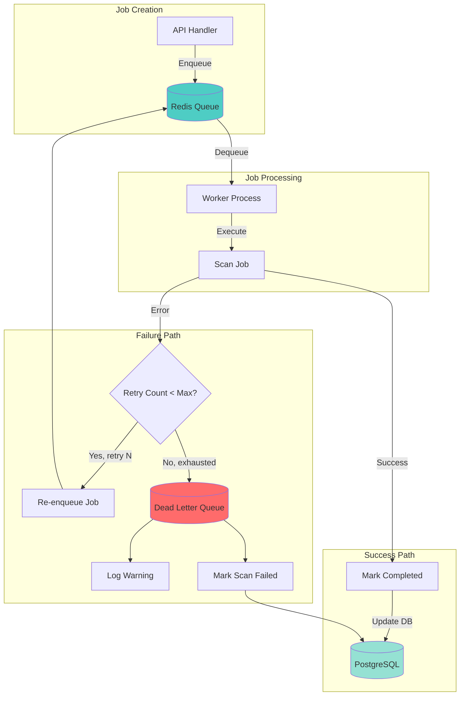
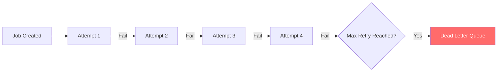
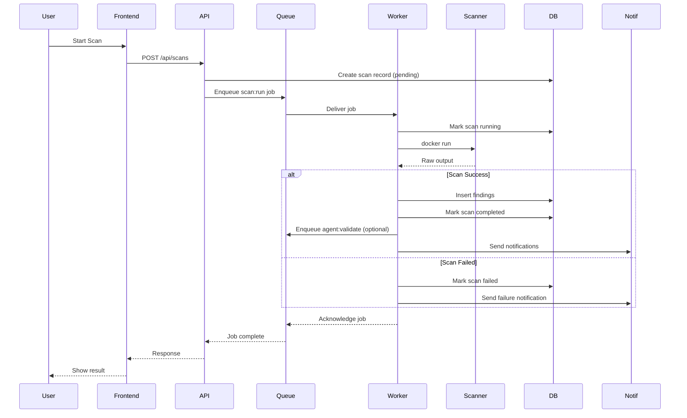
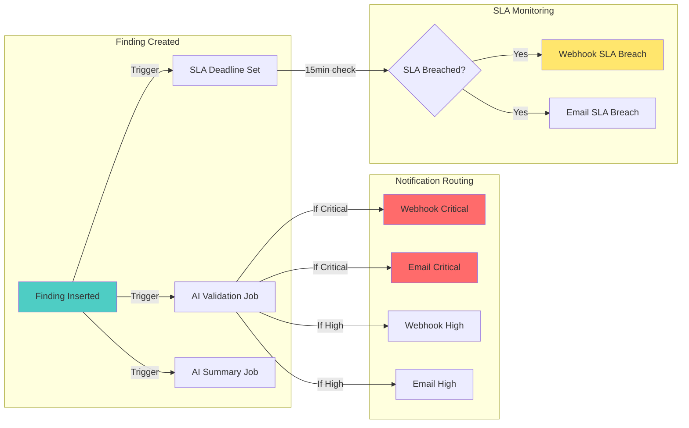
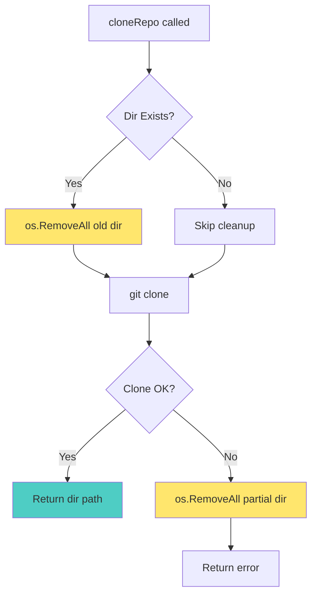

# Queue Architecture & Event Flow

## Overview

HenKaiPan uses **Redis + Asynq** as the background job queue system. This document explains the job lifecycle, retry strategies, and event flow.

---

## 1. Job Lifecycle Flow



---

## 2. Retry Strategy Configuration

### Current Settings

| Job Type | Max Retries | Timeout | Dead Queue |
|----------|-------------|---------|------------|
| `scan:run` | 3 | 30 min | Yes |
| `agent:validate` | 5 | 60 sec | Yes |
| `agent:summarize` | 5 | 60 sec | Yes |
| `webhook:send` | 5 | 30 sec | Yes |
| `email:send` | 5 | 30 sec | Yes |

### Retry Timeline Example

```
Attempt 1: T+0s      ──► Fail
Attempt 2: T+30s     ──► Fail  (exponential backoff)
Attempt 3: T+90s     ──► Fail  (exponential backoff)
Attempt 4: T+270s    ──► Fail  (exponential backoff)
─────────────────────────────────────────────
Result: Job moved to Dead Letter Queue
```

### Code Location

```go
// internal/handlers/scans.go:79
h.queue.Enqueue(
    asynq.NewTask(tasks.TypeScanRun, payload),
    asynq.MaxRetry(3),
    asynq.Timeout(30*time.Minute),
)
```

---

## 3. Dead Letter Queue (DLQ)

### What is it?

The **Dead Letter Queue** is a special Redis queue where Asynq stores jobs that have exhausted all retry attempts. These jobs are:

- ❌ **Not processed automatically** anymore
- 📦 **Preserved for inspection** (debugging, manual retry)
- ⚠️ **Logged as warnings** for monitoring

### When does a job go to DLQ?



### Inspecting the DLQ

**Option 1: Using asynqmon (recommended)**

```bash
# Install asynqmon
go install github.com/hibiken/asynqmon/cmd/asynqmon@latest

# Run web UI
asynqmon --redis-addr localhost:6379

# Open http://localhost:8080
```

**Option 2: Redis CLI**

```bash
# List all dead queue keys
redis-cli KEYS "asynq:{dead}:*"

# Get job details
redis-cli HGETALL "asynq:{dead}:<job-id>"
```

### Recovering from DLQ

**Manual retry via code:**

```go
// Get job from DLQ and re-enqueue
client.Enqueue(originalTask, asynq.MaxRetry(3))
```

**Using asynqmon UI:**
1. Open asynqmon web interface
2. Navigate to "Dead" queue
3. Click on job
4. Click "Retry" button

---

## 4. Event Types & Flow

### Scan Execution Flow



### Finding Notification Flow



### Event Types Summary

| Event | Trigger | Webhook | Email | Retry |
|-------|---------|---------|-------|-------|
| `finding.critical` | New critical finding | ✅ | ✅ | 5 |
| `finding.high` | New high finding | ✅ | ✅ | 5 |
| `finding.sla_breach` | SLA deadline passed | ✅ | ✅ | 5 |
| `scan.completed` | Scan finished | ✅ | ✅ (configurable) | N/A |
| `scan.failed` | Scan failed | ✅ | ✅ (configurable) | N/A |

---

## 5. Queue Architecture

### Redis Queue Structure

```
asynq:
├── {default}              # Main queue (scan:run jobs)
│   ├── pending            # Jobs waiting to be processed
│   ├── active             # Jobs currently being processed
│   ├── processed          # Successfully completed jobs
│   └── dead               # Failed jobs (DLQ)
├── {critical}             # High-priority queue (optional)
└── {dead}                 # Dead letter queue storage
```

### Worker Configuration

```go
// cmd/worker/main.go
srv := queue.NewServer(cfg.RedisAddr, 5)  // 5 concurrent workers

// internal/queue/queue.go
func NewServer(addr string, concurrency int) *asynq.Server {
    return asynq.NewServer(
        asynq.RedisClientOpt{Addr: addr},
        asynq.Config{
            Concurrency: concurrency,  // Max parallel jobs
        },
    )
}
```

### Concurrency Settings

| Setting | Value | Description |
|---------|-------|-------------|
| Concurrency | 5 | Max 5 jobs processed in parallel |
| Queue | default | Single queue (no priority tiers) |
| Strict Priority | No | FIFO ordering |

---

## 6. Cleanup Strategies

### Temporary Directory Cleanup



### Code Implementation

```go
// internal/tasks/scan_run.go:176-210
func cloneRepo(...) (dir string, execLog string, err error) {
    dir = filepath.Join(os.TempDir(), "aspm-scan-"+scanID)

    // 1. Cleanup existing directory from previous failed attempts
    if _, err := os.Stat(dir); err == nil {
        os.RemoveAll(dir)  // Clean before retry
    }

    // 2. Clone repository
    cmd := exec.CommandContext(ctx, "git", "clone", "--depth=50", cloneURL, dir)
    out, cloneErr := cmd.CombinedOutput()
    
    // 3. Cleanup partial clone on failure
    if cloneErr != nil {
        os.RemoveAll(dir)  // Clean after failure
        return "", execLog, fmt.Errorf("git clone: %w", cloneErr)
    }
    
    return dir, execLog, nil
}
```

---

## 7. Monitoring & Observability

### Current Implementation

**✅ Implemented (Business Metrics)**

All business metrics are stored in PostgreSQL and exposed via REST API:

```go
// internal/handlers/metrics.go
GET /api/metrics/summary        // Total scans, findings, active scans
GET /api/metrics/trends?days=30 // Finding trends by severity
GET /api/metrics/risk           // Risk scores per repository
GET /api/metrics/sla-compliance // SLA breach statistics
GET /api/metrics/teams          // Team-level aggregated metrics
```

**✅ Implemented (Queue/Infrastructure Metrics - Prometheus)**

Queue metrics are exposed via Prometheus at `:9090/metrics`:

| Metric | Type | Labels | Source |
|--------|------|--------|--------|
| `asynq_queue_pending_jobs` | Gauge | `queue` | Redis/Asynq |
| `asynq_queue_active_jobs` | Gauge | `queue` | Redis/Asynq |
| `asynq_queue_dead_jobs` | Gauge | `queue` | Redis/Asynq |
| `aspm_scans_total` | Gauge | - | PostgreSQL |
| `aspm_scans_running` | Gauge | - | PostgreSQL |
| `aspm_scans_failed` | Gauge | - | PostgreSQL |
| `aspm_findings_total` | Gauge | `severity` | PostgreSQL |

**Scrape configuration:**

```yaml
# prometheus.yml
scrape_configs:
  - job_name: 'aspm-worker'
    static_configs:
      - targets: ['worker:9090']
    scrape_interval: 30s
```

### Recommended Alerts (Prometheus)

Example alerting rules for Prometheus:

```yaml
# alerting_rules.yml
groups:
  - name: aspm
    rules:
      - alert: ASPMQueueBacklog
        expr: asynq_queue_pending_jobs > 100
        for: 5m
        labels:
          severity: warning
        annotations:
          summary: "ASPM queue has {{ $value }} pending jobs"
          
      - alert: ASPMDeadQueueNotEmpty
        expr: asynq_queue_dead_jobs > 0
        for: 1m
        labels:
          severity: critical
        annotations:
          summary: "ASPM dead queue has {{ $value }} jobs - check worker logs"
          
      - alert: ASPMHighScanFailureRate
        expr: aspm_scans_failed / aspm_scans_total > 0.2
        for: 10m
        labels:
          severity: warning
        annotations:
          summary: "{{ $value | humanizePercentage }} of scans are failing"
```

---

## 8. Best Practices

### ✅ DO

- Set explicit `MaxRetry` for all jobs
- Use `Timeout` to prevent hung jobs
- Log retry exhaustion warnings
- Clean up temporary resources on failure
- Monitor dead queue regularly
- Use `defer` for cleanup in success paths

### ❌ DON'T

- Enqueue jobs without retry limits
- Ignore dead queue warnings
- Leave temporary files on failure
- Use infinite retries (default Asynq behavior)
- Forget to acknowledge jobs manually if using manual ack

---

## 9. Troubleshooting

### Common Issues

**Issue: Jobs stuck in pending**

```bash
# Check worker is running
ps aux | grep worker

# Check Redis connection
redis-cli ping

# Check queue depth
asynqmon stats
```

**Issue: High dead queue count**

```bash
# Inspect dead jobs
asynqmon  # Open web UI

# Check worker logs for patterns
grep "Retry exhausted" /var/log/worker.log
```

**Issue: Worker not processing jobs**

```bash
# Restart worker
systemctl restart aspm-worker

# Check logs
journalctl -u aspm-worker -f
```

---

## 10. How to Implement Queue Monitoring

### Option 1: Add asynqmon to docker-compose (Recommended)

```yaml
# docker-compose.yml
services:
  asynqmon:
    image: ghcr.io/hibiken/asynqmon:latest
    ports:
      - "8080:8080"
    environment:
      - ASYNQMON_REDIS_ADDR=redis:6379
    depends_on:
      - redis
```

**Quick start:**

```bash
# Install locally
go install github.com/hibiken/asynqmon/cmd/asynqmon@latest

# Run
asynqmon --redis-addr localhost:6379

# Open http://localhost:8080
```

### Option 2: Add Prometheus metrics endpoint

**Implementation (already included):**

The worker exposes Prometheus metrics at `:9090/metrics`:

```go
// cmd/worker/main.go
metrics.StartPrometheusServer(":9090")
metrics.StartQueueMetricsCollector(ctx, inspector, 30*time.Second)
metrics.StartDBMetricsCollector(ctx, getMetrics, 60*time.Second)
```

**Exposed metrics:**

| Metric | Type | Labels | Description |
|--------|------|--------|-------------|
| `asynq_queue_pending_jobs` | Gauge | `queue` | Pending jobs per queue |
| `asynq_queue_active_jobs` | Gauge | `queue` | Active jobs being processed |
| `asynq_queue_dead_jobs` | Gauge | `queue` | Archived (dead) jobs |
| `aspm_scans_total` | Gauge | - | Total scans in DB |
| `aspm_scans_running` | Gauge | - | Scans currently running |
| `aspm_scans_failed` | Gauge | - | Failed scans |
| `aspm_findings_total` | Gauge | `severity` | Findings by severity |

**Scrape config:**

```yaml
# prometheus.yml
scrape_configs:
  - job_name: 'aspm-worker'
    static_configs:
      - targets: ['localhost:9090']
    scrape_interval: 30s
```

**Docker Compose setup:**

```yaml
# docker-compose.yml
services:
  worker:
    build: .
    command: ./bin/worker
    expose:
      - "9090"  # Expose metrics port
    
  prometheus:
    image: prom/prometheus:latest
    ports:
      - "9090:9090"
    volumes:
      - ./prometheus.yml:/etc/prometheus/prometheus.yml
      - prometheus_data:/prometheus
    depends_on:
      - worker
```


### Option 3: Log queue stats periodically

```go
// Add to worker main.go
go func() {
    inspector := asynq.NewInspector(asynq.RedisClientOpt{Addr: cfg.RedisAddr})
    ticker := time.NewTicker(1 * time.Minute)
    for range ticker.C {
        stats, err := inspector.GetQueueInfo("default")
        if err != nil {
            slog.Warn("get queue stats failed", "err", err)
            continue
        }
        slog.Info("queue stats",
            "pending", stats.Pending,
            "active", stats.Active,
            "dead", stats.Dead)
    }
}()
```

### Option 4: Add API endpoint for queue stats

```go
// internal/handlers/metrics.go
func (h *Handler) GetQueueStats(w http.ResponseWriter, r *http.Request) {
    inspector := asynq.NewInspector(asynq.RedisClientOpt{Addr: h.redisAddr})
    info, err := inspector.GetQueueInfo("default")
    if err != nil {
        writeError(w, http.StatusInternalServerError, "failed to get queue stats")
        return
    }
    writeJSON(w, http.StatusOK, map[string]any{
        "pending": info.Pending,
        "active":  info.Active,
        "dead":    info.Dead,
    })
}
```

---

## 11. Related Files

| File | Purpose |
|------|---------|
| `internal/handlers/scans.go` | Job enqueueing with retry config |
| `internal/handlers/metrics.go` | Business metrics API endpoints |
| `internal/tasks/scan_run.go` | Job execution + temp directory cleanup |
| `internal/queue/queue.go` | Queue client/server setup |
| `cmd/worker/main.go` | Worker bootstrap + job handler registration |
| `cmd/api/main.go` | API server + metrics endpoints |
| `internal/repository/scan.go` | Scan status updates + recovery |
| `internal/repository/metrics.go` | PostgreSQL metrics queries |

---

## Summary

1. **Jobs are enqueued** with `MaxRetry(3)` and `Timeout(30min)`
2. **Failed jobs retry** up to 3 times with exponential backoff
3. **Exhausted jobs** go to Dead Letter Queue for inspection
4. **Temporary directories** are cleaned on both success and failure
5. **Worker recovers** stuck scans on startup
6. **Notifications** are sent for critical events (findings, SLA breaches, scan failures)
7. **Business metrics** are exposed via REST API (`/api/metrics/*`)
8. **Queue metrics** require asynqmon or custom implementation (not included)
